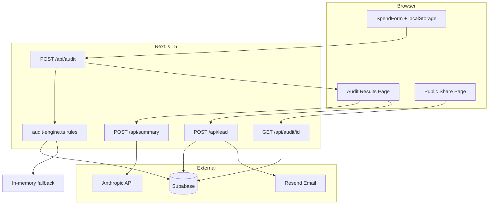

# StackSweep Architecture

## System diagram

## Data flow

1. User completes **SpendForm** → persisted in `localStorage`.
2. **POST /api/audit** validates with Zod, honeypot rejects bots, rate limit per IP.
3. **`runAudit()`** applies list-price rules (no LLM) → `AuditResult`.
4. Result saved to **memory map** (dev) + **Supabase** `audits` (prod).
5. Client routes to `/audit/[id]`; fetches **LLM summary** via `/api/summary` with template fallback.
6. **Lead capture** after results → `/api/lead` → `leads` table + Resend email.
7. **Public share** `/share/[id]` uses `publicAuditView()` — strips PII, keeps tools + savings; OG metadata generated server-side.

## Stack choice

| Choice | Why |
|--------|-----|
| **Next.js 15 + TypeScript** | SSR for share previews, API routes, Vercel deploy, strong types for audit rules |
| **Tailwind 4** | Fast UI, small bundle, meets Lighthouse targets |
| **Supabase** | Postgres + simple SDK for audits/leads without custom auth |
| **Vitest** | Fast unit tests for pure `audit-engine` |
| **Rules engine, not LLM** | Auditors and finance reviewers need reproducible math |

## Abuse protection

- **Honeypot field** `website` (hidden) — bots fill → silent 400 on audit, fake success on lead.
- **Rate limit** 8 req/hour/IP in-memory (`rate-limit.ts`) — upgrade to Upstash Redis at scale.

## At 10k audits/day

- Move rate limiting to **Redis/Upstash**
- **Queue** Resend emails (Inngest / SQS)
- **Read replicas** for share page; cache OG metadata at edge
- Precompute **benchmark percentiles** offline from anonymized spend
- Split **audit-engine** into versioned rules package for CI regression
